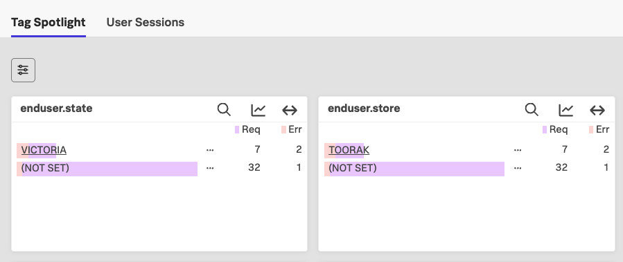

# 🌍 AppDynamics GeoServer → Splunk RUM Custom Geo Tagging

This snippet enables **custom IP/subnet-based geo location tagging** using an AppDynamics GeoServer ([link](https://help.splunk.com/en/appdynamics-on-premises/end-user-monitoring/26.4.0/end-user-monitoring/browser-monitoring/browser-real-user-monitoring/host-a-geo-server)) and injects the resolved location into **Splunk Observability RUM global attributes**.

It is useful when:
- You already have an AppDynamics GeoServer providing IP → location mapping
- You want to enrich RUM sessions with **internal ip/subnet based location names**
- You want to avoid backend changes and do everything at the browser layer

---

# 🚀 How it works

1. It needs host:port of the existing AppDynamics GeoServer
2. The existing mapping is used to populate custom location names based on user internal ip address:

# Snippet

Update geoserver IP and PORT

```js
//****** Tag custom geo location *******
let geoserver="http(s)://IP:PORT"
let storeIp = true;             // Change if want to store IP address
let geoBuffer = null;
let geoApplied = false;
window.ADRUM = window.ADRUM || {};
window.ADRUM.geo = window.ADRUM.geo || {};

function applyGeoIfReady() {
    if (geoApplied || !geoBuffer) return;
    geoApplied = true;
    console.log("Setting tags")
    SplunkRum.setGlobalAttributes({
        'enduser.store': geoBuffer.city,
        'enduser.country': geoBuffer.country,
        'enduser.state': geoBuffer.region
    });
    if (storeIp)
    {
        SplunkRum.setGlobalAttributes({
            'enduser.ip': hexToIp(geoBuffer.localIP)
        });
    }
}

function hexToIp(hex) {
    return hex.match(/.{1,2}/g)
        .map(x => parseInt(x, 16))
        .join('.');
}

function getLocation(geoserver) {
    const s = document.createElement("script");
    s.src = geoserver;
    s.onload = function () {
        const r = window.ADRUM?.geo?.result;
        if (!r) {
            return;
        }
        geoBuffer = {
            city: r.city,
            country: r.country,
            region: r.region,
            localIP: r.localIP
        };
        applyGeoIfReady();
    };
    document.head.appendChild(s);
}

getLocation(geoserver+"/geo/resolve.js");
setTimeout(applyGeoIfReady, 1000);
//****** Tag custom geo location *******
```

---
Create RUM metricsets for the new attributes and you'll be able to use these in tag spotlight and charts
# 📸 Example



